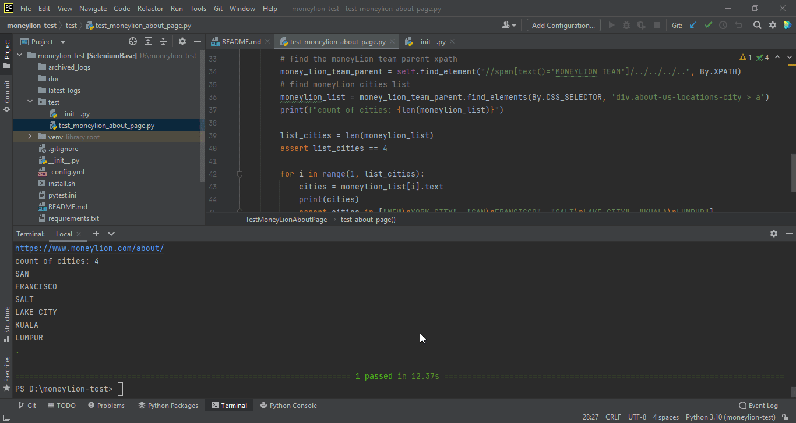

# moneyLion selenium test 
this is an assessment project that I did for moneyLion

I notice that after clicking on the about page it will navigate to the correct page but request will show time out which I wasn't able to get request == 200.
## Simple tests:
1. This contains 1 test, 
    - as a new user click on about and go to the about page. test if the cities names are under MoneyLion Team text
   
```shell
pytest test/test_moneylion_about_page.py
```



##how to run?

```
pip install -e . 
pytest path-to-file/filename.py
